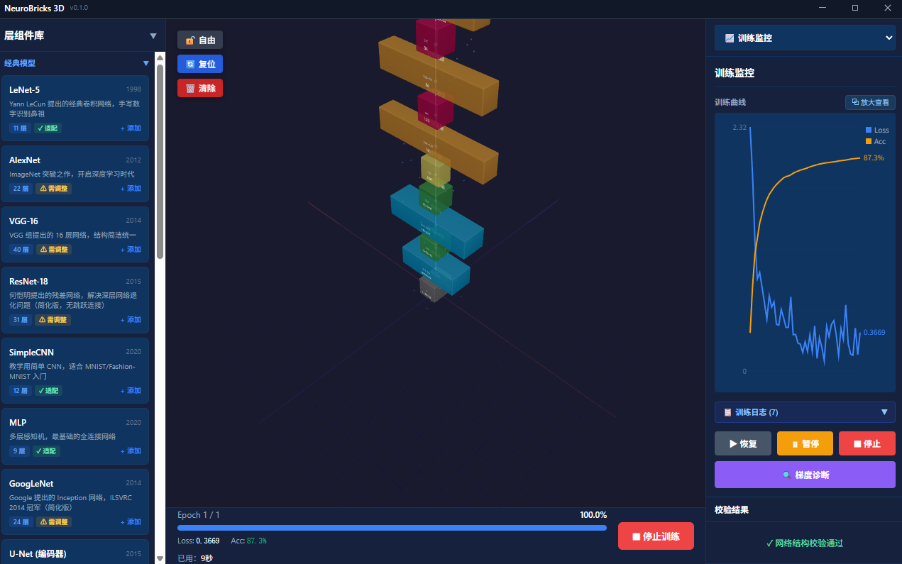
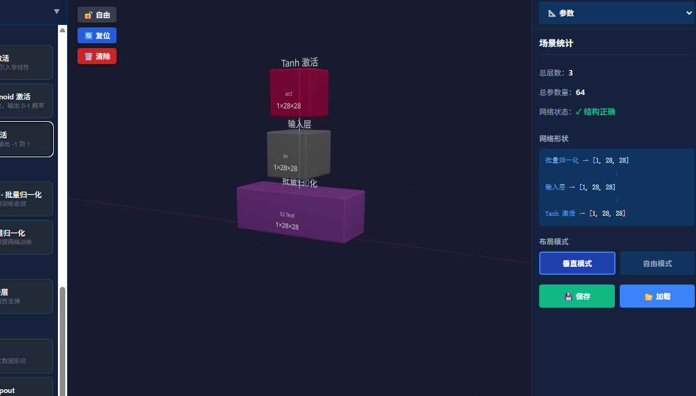

# NeuroBricks 3D — 神经网络三维构建工坊

**在 3D 空间中拖拽积木搭建神经网络，实时校验张量形状，一键启动 PyTorch 真实训练。**

*Build neural networks by stacking 3D blocks — drag, drop, validate tensor shapes in real time, and launch real PyTorch training with one click.*




## ✨ 功能特性

### 🧱 可视化搭建
- **3D 积木拖拽搭建** — 12 种层类型（Conv2D、MaxPool2D、Linear、ReLU、BatchNorm、Dropout、Flatten 等）
- **8 个经典模型预设** — LeNet-5、AlexNet、VGG-16、ResNet-18、GoogLeNet、MLP、SimpleCNN、U-Net，点击一键生成
- **实时形状校验** — 层间张量形状自动推导，不匹配时红色高亮 + 期望/实际对比提示
- **实时 PyTorch 代码面板** — 搭积木的同时实时查看对应 PyTorch 代码，一键复制

### 🚀 真实训练
- **内置数据集开箱即用** — MNIST / CIFAR-10，选完即训
- **自定义数据集** — 本地图像文件夹、CSV（支持 UTF-8/GBK 中文编码）、Excel
- **PyTorch 本地训练** — 独立打包的 Python sidecar，CUDA GPU 自动检测与降级
- **训练全程可视化** — 实时 Loss/Accuracy 曲线、训练日志、历史记录对比
- **独立曲线窗口** — 曲线可弹出为独立窗口，自由移动/缩放，训练中实时更新
- **训练完成报告** — 准确率、Loss、时长、参数量、最佳 Epoch 汇总卡片

### 🔍 模型推理
- **模型卡片管理** — 每次训练生成独立模型卡片，多卡并存、重命名、删除、重启不丢失
- **图片预测** — 选择卡片 + 上传图片，返回 Top-5 类别与置信度
- **类别语义化** — MNIST 显示数字、CIFAR-10 显示中文类别名

### 💾 导出与工程
- **代码导出** — 一键生成可运行的 PyTorch / Keras 模型代码
- **权重导出** — `.pth`（state_dict）/ `.pt`（完整模型）/ `.npz`（NumPy 通用）
- **项目保存/加载** — `.nbproj` 格式保存网络结构
- **GPU 检测面板** — CUDA 设备、显存、CPU/内存信息一览

## 🖥️ 技术栈

| 层级 | 技术 | 说明 |
|------|------|------|
| 框架 | Tauri v1 | 轻量桌面壳，Rust 后端 |
| 前端 | React 18 + TypeScript | UI 与状态管理 |
| 3D 渲染 | React Three Fiber + Three.js | 三维场景与积木渲染 |
| 状态管理 | Zustand | 轻量响应式 store |
| 构建工具 | Vite | 前端开发与构建 |
| 后端 | Rust | 进程管理、文件系统、事件桥接 |
| 训练引擎 | Python + PyTorch | sidecar 进程，支持 CUDA |
| 打包 | PyInstaller + NSIS/MSI | sidecar 独立 exe + Windows 安装包 |

## 📦 安装

从 [Releases](https://github.com/nanliuqi/neurobricks-3d/releases) 页面下载最新安装包：

- **Windows 安装包**：`NeuroBricks 3D_x.x.x_x64-setup.exe`（双击安装，推荐）

安装包已内置训练引擎与数据集，**无需安装 Python 或任何依赖**，装完即用。

> 系统要求：Windows 10/11（64 位）

## 📖 快速上手

1. **搭建网络** — 左侧积木库拖入层，或展开"经典模型"点击预设一键生成
2. **选择数据集** — 右侧"📊 数据集"面板选择 MNIST
3. **开始训练** — 底部训练栏点【🚀 开始训练】，训练监控面板查看实时曲线
4. **查看曲线** — 点"⧉ 放大查看"弹出独立曲线窗口
5. **模型推理** — 右侧"🔍 推理"面板，选择模型卡片 + 上传图片即可预测
6. **导出成果** — 右侧"💾 导出"面板，导出代码或权重文件

## 📸 界面预览

| 3D 搭建场景 | 模型推理 |
|:---:|:---:|
|  |  |

## 👨‍💻 开发环境

前置要求：Node.js 18+、Rust toolchain（rustup）、Python 3.10+（仅重新打包 sidecar 时需要）

```bash
git clone https://github.com/nanliuqi/neurobricks-3d.git
cd neurobricks-3d

npm install          # 前端依赖
npm run tauri dev    # 开发模式（前端 + Tauri）
npm run tauri build  # 构建安装包
```

## 📁 项目结构

```
neurobricks-3d/
├── src/                    # 前端源码
│   ├── components/
│   │   ├── scene3d/        # 3D 场景（积木、连接线、粒子）
│   │   ├── panels/         # 侧边面板（参数/数据集/导出/推理/代码）
│   │   ├── training/       # 训练相关（监控、曲线、结果卡片）
│   │   └── layout/         # 布局（标题栏、主框架）
│   ├── stores/             # Zustand 状态管理
│   ├── utils/              # 形状推导、代码生成、类别标签
│   └── types/              # TypeScript 类型定义
├── src-tauri/              # Tauri 后端
│   ├── src/commands/       # Rust 命令（训练/推理/GPU/数据集/导出）
│   └── sidecars/nb-trainer/# Python 训练 sidecar（PyTorch）
└── public/chart.html       # 独立曲线窗口页面
```

## 🗺️ 路线图

- [x] 3D 积木搭建与实时形状校验
- [x] 内置数据集 + PyTorch 本地训练（CUDA 支持）
- [x] 训练可视化（曲线、日志、历史、独立曲线窗口）
- [x] 模型推理（图片预测 + 模型卡片管理）
- [x] 代码/权重导出、项目保存加载
- [ ] 云端训练（SSH 远程服务器）
- [ ] 更多层类型（LSTM、Transformer、Embedding）
- [ ] 训练超参搜索
- [ ] macOS / Linux 支持

## 📄 License

[MIT](LICENSE) © nanliuqi

---

如果这个项目对你有帮助，欢迎 ⭐ Star 支持一下！
